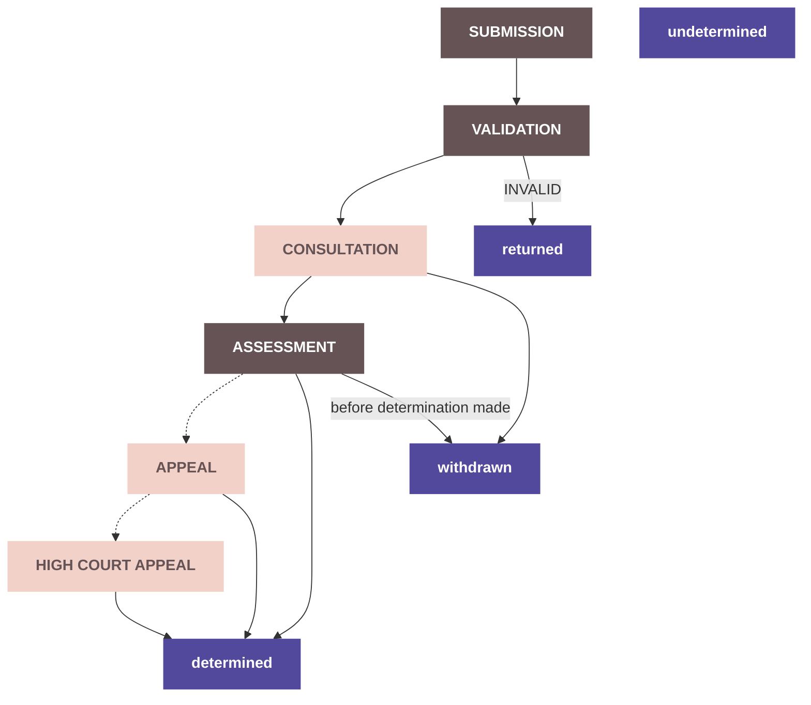
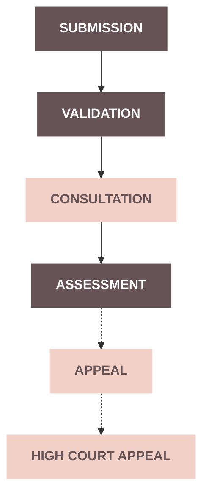
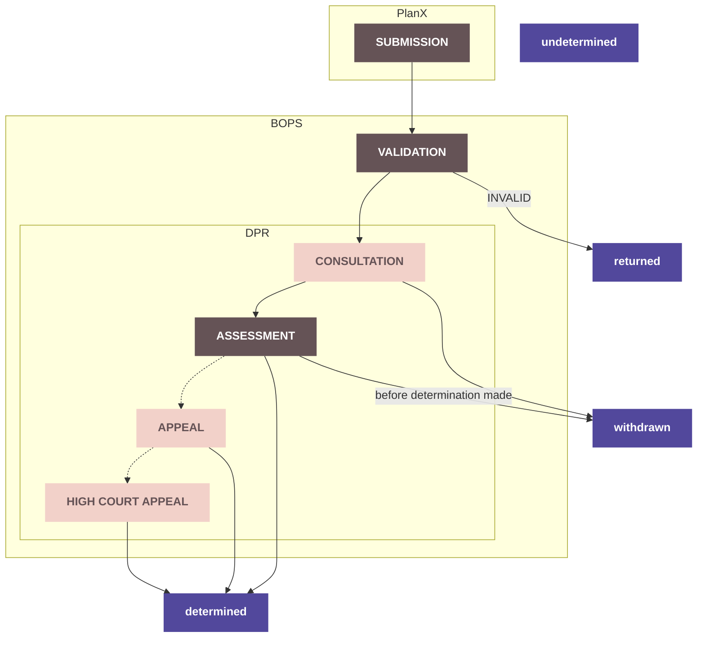

# Post Submission Application Schema

The Post Submission Application schema is designed to represent an application, post-submission, within an application.

Future iterations will create redacted versions of this, and the `PrototypeApplication` schema, which will act as a 'published' schema for applications such as the [DPR](https://planningregister.org/).

## The Application Process



There are a lot of different ways to define the application process, there is the process for the applicant, the agent and the backend processes in BOPs. The DPR is also displaying the information in a specific way as well. I wanted to try and come up with a process that was flexible, future proof and easy to read and discern information from.

A strict rigid structure wasn't going to work too well since there are so many "if this then thats" so this is what I have come up with.

### Stages

All applications go through these stages and they pick up various contextual pieces of information along their way



Submission, Validation and Assessment are all required stages. Whereas consultation, appeal and high court appeal are optional, dependant on other conditions.

**The stage an application is in does not determine its status.**

### Status


Each status reflects a higher level state which an application can be in. (This field could also be called state I guess)

- An application is **returned** if it is marked as invalid.
- An application can be **withdrawn** after submission and until a decision is made ie it is **determined**
- An application is **determined** if _any_ decision has been made about it, this could be assessment, appeal or high court appeal decisions
- An application is set to **undetermined** at all other times

I wanted to avoid being too prescriptive in the status's. There are so many variations that this felt more straight forward. From each of these status' you should be able to quickly determine the rest of the information you need about an application, eg was it an appeal or a council decision that was made.

### How we all fit in



## The structure

```ts
interface ApplicationSpecification<
  TPrimary extends PrimaryApplicationType,
  TGranular extends ApplicationType,
> {
  applicationType: TGranular;
  data: {
    application: Application<TPrimary>;
    localPlanningAuthority: LocalPlanningAuthority<TPrimary>;
    submission: Submission<TPrimary>;
    validation: Validation<TPrimary>;
    consultation?: Consultation<TPrimary>;
    assessment?: Assessment<TPrimary>;
    appeal?: Appeal<TPrimary>;
    caseOfficer: CaseOfficer<TPrimary>;
  };
  comments?: {
    public?: PublicComments;
    specialist?: SpecialistComments;
  };
  submission: PrototypeApplication;
  metadata: PostSubmissionMetadata;
}
```

### data.Application

This is where I have added the reference number for an application.

It also shows the stage and status.

### data.localPlanningAuthority

This section includes things about the application that are unique to that LPA. See comments below for more information on this.

### data.submission

This contains `submittedAt` - this is the date which the application was submitted, either through PlanX or for example the date written on the envelope if it was posted.

### data.validation

`receivedAt` is the date that the application is received by the back office system. It may not be the date it was sent, if there have been delays in the submission process.

`validatedAt` is the date `isValid` was set, its presence doesn't mean that the application was valid

This includes a flag for `isValid`, which can be used alongside status to find out when an application was set to `returned`.

### data.consultation?

This includes the beginnings of the sitenotice work for the DSN (currently a boolean).

The `startDate` and `endDate` of the consultation period.

Currently there is nothing in here about expiryDate or extensions to the consultation period.

During the consultation period an application can recieve comments.

Not all application types have consultation periods - this is something that will need doing.

### data.assessment?

Assessment is when the council and optionally a committee make a decision. `councilDecision`, `committeeSentDate` and `committeeDecision`

If an application is Prior Approval it also has `priorApprovalRequired` since they can be 'Prior approval required and approved', 'Prior approval not required', 'Prior approval required and refused'

Until there is a decision in this section an application is `undetermined`

### data.appeal?

Appeal's are lodged, started, validated then decided.

While an appeal decision is being made an application is still set to `determined`.

### data.caseOfficer

This is the officer assigned to the application throughout the process.

### Comments

We've also proposed the beginning of a structure for comments in this section, See comments below for more information on this.

### metadata.publishedAt

I haven't included 'published' as a stage because an application can be published at any time, its also not a status its something else. I have added publishedAt into the metadata to match other metadata submittedAt.

### Submission

Rather than repeat the same data for the Post Submission version, I've attached the original submission to this schema, which will have a redacted version at a later date. This makes it so that only additional data, post submission, gets added to this schema. For example Case Officer.

## Comments

Comments can be submitted during the consultation period, which can bet determiend by looking in the `data.consultation.startDate` and `data.consultation.endDate` fields.

Not all applications have a consultation period, however some LPA's accept comments until a decision is made. I have added the `data.localPlanningAuthority.commentsAcceptedUntilDecision` flag so that each LPA can set this and this flag will allow the DPR to determine whether or not comments can be sent - without complicating the application process

## Technical Notes on the Implementation

I have purposely not modified anything in `PrototypeApplication` and have chosen to reference things in their folders rather than move them to `shared/` - this was mostly to make the PR process a little easier and to avoid tricky rebases as this schema is still very much in draft form!

## Appendix

One more diagram! [flow.png](flow.png)


### Current valid application types for Post Submission Schema:

- ldc (Lawful Development Certificate)
  - doesn't have a consultation period
- pa (Prior Approval)
  - has an additional field in assessment to generate an alternate decision
- pp
- listed
- landDrainageConsent

Test case for application type: pp.full

1.  stage: submission, status: undetermined
2.  (before validation happens) stage: validation, status: undetermined, only validation.receivedAt is set
3.  (validated - passed - this will never exist - go straight to consultation step 5) stage: validation, status: undetermined, validation.receivedAt is set, validation.validatedAt is set, validatedAt.isValid is true
4.  (validated - failed) stage: validation, status: returned, validation.receivedAt is set, validation.validatedAt is set, validatedAt.isValid is false
5.  (consultation is in progress - current date is between consultation start and end date) stage: consultation, status: undetermined, consultation.startDate is set, consultation.endDate is set
6.  (withdrawn during consultation) stage: consultation, status: withdrawn, withdrawnAt is set, withdrawnReason is set, consultation.startDate is set, consultation.endDate is set
7.  (current date is after consultation end date) stage: assessment, status: undetermined
8.  (withdrawn during assessment before council determination made) stage: assessment, status: withdrawn, consultation.startDate is set, consultation.endDate is set
9.  (assessment has a decision - passed) stage: assessment, status: determined, councilDecision is granted
10. (assessment has a gone to committee - no decision yet) stage: assessment, status: determined, councilDecision is granted, committeeSentDate is set
11. (assessment has a gone to committee - decision) stage: assessment, status: determined, councilDecision is granted, committeeSentDate is set, committeeDecision is set
12. (assessment has a decision - failed) stage: assessment, status: determined, councilDecision is refused
13. (appeal has been made - failed) stage: appeal, status: determined, councilDecision is refused, appeal.reason is set, appeal.lodgedDate is set,
14. (appeal has been validated) stage: appeal, status: determined, councilDecision is refused, appeal.reason is set, appeal.lodgedDate is set, appeal.validatedDate is set
15. (appeal has been started) stage: appeal, status: determined, councilDecision is refused, appeal.reason is set, appeal.lodgedDate is set, appeal.validatedDate is set, appeal.startedDate is set
16. (appeal has finished - allowed) stage: appeal, status: determined, councilDecision is refused, appeal.reason is set, appeal.lodgedDate is set, appeal.validatedDate is set, appeal.startedDate is set, appeal.decisonDate is set, appeal.decision is allowed
17. (appeal has finished - dismissed) stage: appeal, status: determined, councilDecision is refused, appeal.reason is set, appeal.lodgedDate is set, appeal.validatedDate is set, appeal.startedDate is set, appeal.decisonDate is set, appeal.decision is dismissed
18. (appeal has finished - split_decision) stage: appeal, status: determined, councilDecision is refused, appeal.reason is set, appeal.lodgedDate is set, appeal.validatedDate is set, appeal.startedDate is set, appeal.decisonDate is set, appeal.decision is split_decision
19. (appeal has finished - withdrawn) stage: appeal, status: determined, councilDecision is refused, appeal.reason is set, appeal.lodgedDate is set, appeal.validatedDate is set, appeal.startedDate is set, appeal.decisonDate is set, appeal.decision is withdrawn
